# VOIS-CICD-ON-EKS

## Overview
This project aims to create a simple Node.js application with a CI/CD pipeline. It utilizes infrastructure provisioning using Terraform, Ansible for configuration management, and Jenkins for continuous integration and deployment (CI/CD). The project includes the following components:

- Infrastructure: VPC, subnets, route tables, security groups, EC2 instances, and EKS cluster.
- Ansible: Automation of configuration for the public EC2 instance.
- Jenkins: Deployment of Jenkins on the EKS cluster using manifests and Ansible.
- Node.js App: A sample Node.js application that will be built and deployed using the CI/CD pipeline.

<div align="center">
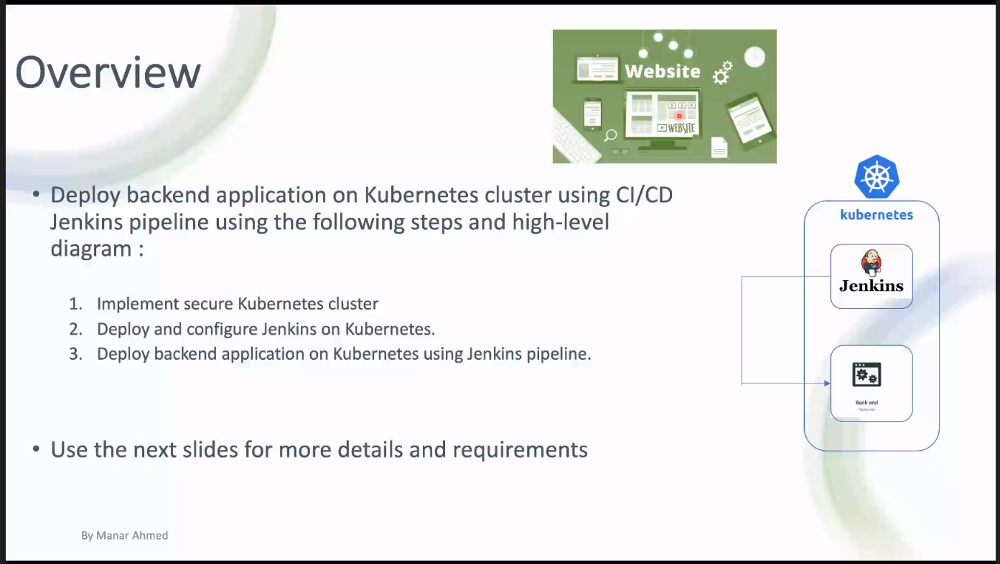
<i>project overview</i>
</div>

## Installation

### 1. Infrastructure Provisioning
1. Clone the repository:
   ```
   git clone https://github.com/khgad/CICD-ON-EKS.git
   ```

2. Navigate to the infrastructure directory:
   ```
   cd terraform
   ```

3. Initialize the Terraform working directory:
   ```
   terraform init
   ```

4. Create the infrastructure:
   ```
   terraform apply
   ```

### 2. Configuration of Public EC2 Instance
1. After the Terraform provisioning is complete, Ansible will automatically configure the public EC2 instance.

<div align="center">
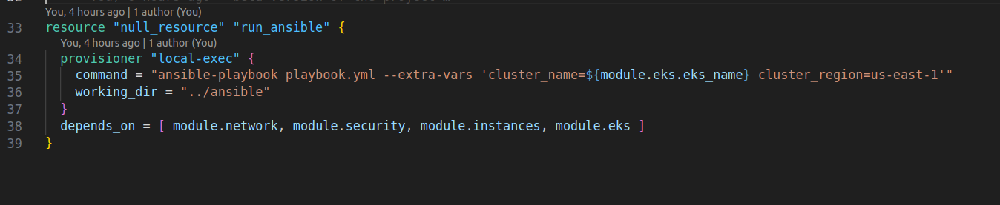
<i>automate ansible run</i>
</div>

### 3. Deployment of Jenkins on EKS
1. Ensure that the public EC2 instance has been successfully configured and jenkins is deployed.

<div align="center">
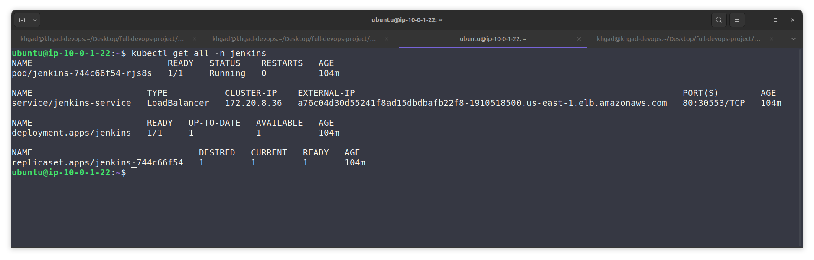
<i>ensure jenkins deployment</i>
</div>

2. Retrieve the load balancer URL and Jenkins administrator password from the output of the Terraform apply command.

<div align="center">
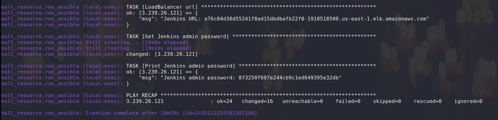
<i>ansible result</i>
</div>


3. Access the Jenkins URL in your web browser and use the administrator password to log in.

4. Follow the Jenkins setup wizard to complete the initial configuration.

<div align="center">
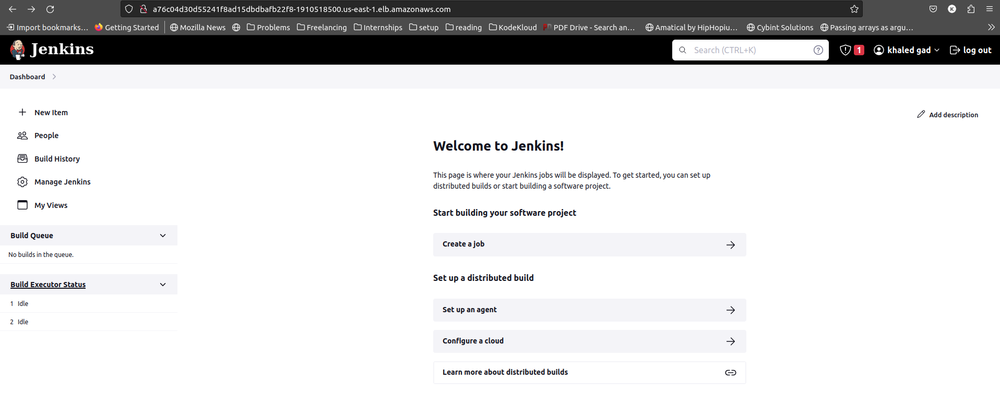
<i>jenkins page</i>
</div>

### 4. Create new slave
1. In the Jenkins interface, create new slave by going to `Manage Jenkins` then `Nodes and Clouds`.

<div align="center">
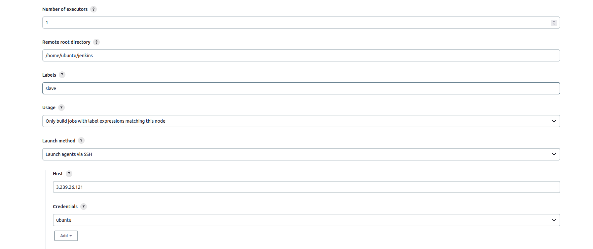
<i>salve configuration</i>
</div>

<div align="center">
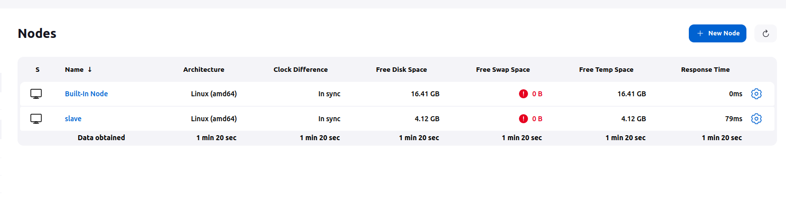
<i>slave node</i>
</div>


### 5. Configuration of CI/CD Pipeline
1. In the Jenkins interface, create a new pipeline job.

2. Configure the pipeline to connect to your version control system (e.g., Git) and specify the repository URL for your Node.js application.

<div align="center">
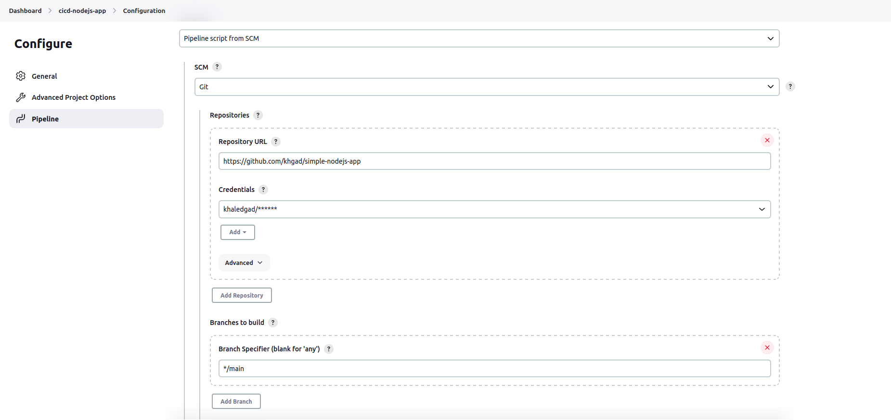
<i>pipeline configuration</i>
</div>

3. Save the pipeline configuration and trigger the pipeline to start the CI/CD process.

- Jenkins will automatically build, test, and deploy your Node.js application based on the pipeline configuration.

<div align="center">
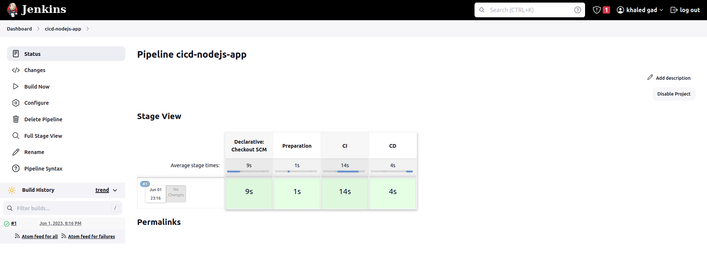
<i>success pipeline</i>
</div>

### 6. Access the application
1. get load balancer url from aws which is created when creating service for our application in the pipeline.

<div align="center">
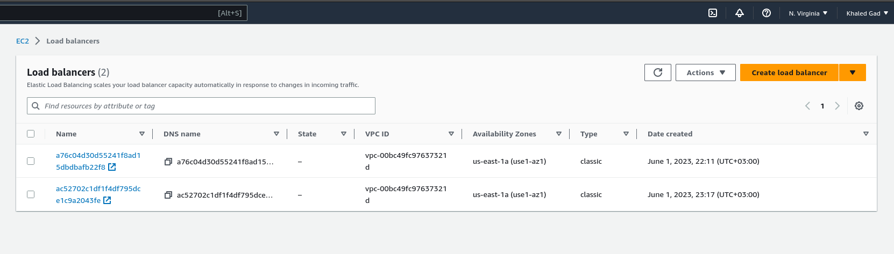
<i>2 load balancers: 1 for jenkins and 1 for the app</i>
</div>


2. hit load-balancer url to get the application

<div align="center">
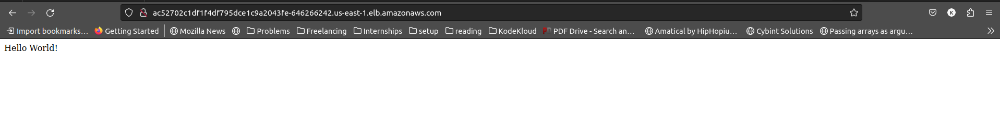
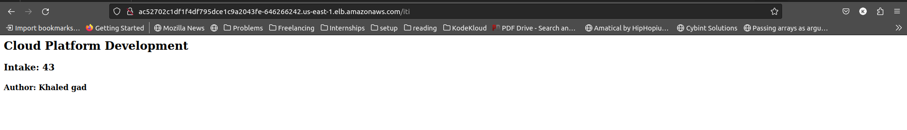
<i>app is running</i>
</div>

## Troubleshooting
- If you encounter any issues during the infrastructure provisioning, Ansible configuration, or Jenkins deployment, refer to the relevant logs or error messages for troubleshooting.
- Make sure all dependencies and prerequisites are correctly installed and configured.
